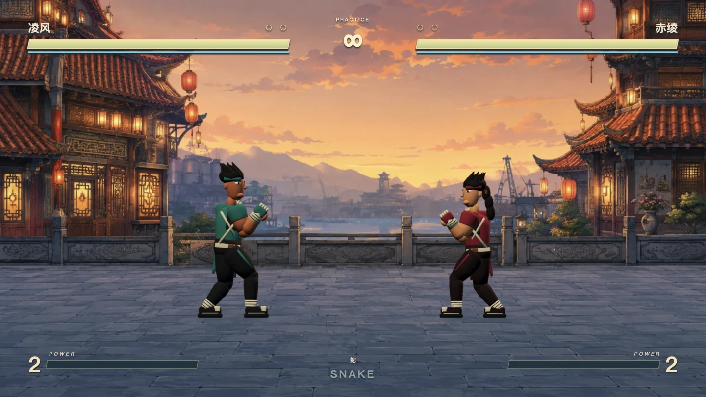
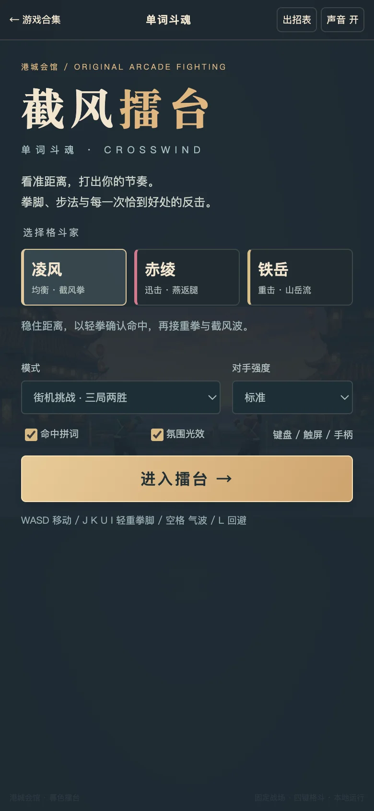
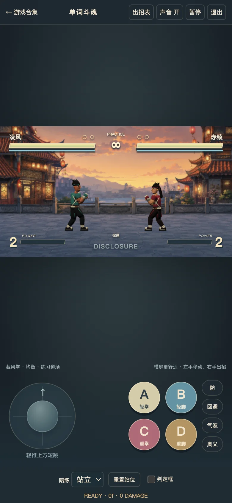

# 关节修正与暮港材质光照

日期：2026-09-06。实现版本 `20260906-joints`，模型 `v3`。本轮只修改单词斗魂及其合集入口。

## 发现的实际问题

1. 姿势中膝盖配置为前弯，末端 IK 却硬编码为反向。原检查只检查有限值和单段长度，漏掉了弯曲方向。
2. 对已经求解的肘膝直接做线性插值，会在显示中间帧缩短肢体连线，刚性网格因此脱节。改为插值控制点后重新解固定长度 IK。
3. 步频系数没有匹配模型尺寸 / 步幅，墙边与推挤后仍可能滑步。改为使用推挤完成后的真实位移驱动步态，三个人物分别按自身比例计算。
4. 翻滚的后侧肩髋未跟随躯干转动，鞋子旋转也没有同步踝点；翻滚入口 / 出口姿势突然切换。修正旋转与收身过渡，并按实际新 GLB 顶点检查头部接地。

## 实际应用的美术链

- **imagegen**：内置工具生成低对比提花织物，压为共享 512 × 512 JPEG；应用于模型衣裤，不是只生成一张展示图。完整提示、原始输出与消费路径见 [textile-prompt.md](textile-prompt.md)。
- **Blender**：三个 v3 GLB，领口、交叠衣襟、金属细边、缝线、护手、鞋底、下颌 / 鼻梁和弧形发束。修正材质颜色从 sRGB 到线性空间的输入；可编辑源为 `art/crosswind-fighters-v3.blend`。
- **Three.js / WebGL**：冷暖主辅光、暖色轮廓光、共享布纹及粗糙度；两个池化局部光源响应气波 / 命中；支撑脚分别有随抬脚淡出的接地阴影。不启用实时阴影贴图或全屏 Bloom。
- **Canvas2D**：静态暗角与暖色散光只烘焙一次到背景缓存；实时层仅绘制有限尘粒、局部命中光晕和每人最多五点的拳脚轨迹。无逐帧纹理生成。
- **镜头**：开场最多 5.5% 缓慢拉远，开打前回到 1 倍。背景、模型、投射物和命中效果使用一致投影；交战不震屏、不突然推拉。菜单“氛围光效”可关闭；尊重系统减少动态效果设置。

参考了 [Thomas Ricouard 的实机视频](https://x.com/Dimillian/status/2096278588173484106) 中材质统一、局部照明和清晰战斗反馈；作者在[回复](https://x.com/Dimillian/status/2096343950105666029)中说明使用 Canvas2D 和 WebGPU。其作品是俯视角动作游戏，本作保留侧视格斗和固定距离，没有声称复现其完整美术品质，也未把 Blender 归为该作者使用的工具。

## 验收与诚实边界

- `node --test tests/fury-combat.test.mjs`：**43 / 43**。新增前弯膝盖、退化 IK、所有八段肢体在插值帧中的长度、三人体型 / 双朝向步态接地、旋转踝点和翻滚端点过渡检查。
- `tests/fury-motion.html`：生产模型、生产姿势 / 渲染代码的受控姿态检查，明确标注“非实战”。三个角色 × 28 翻滚帧的半帧插值中，实际头部网格最低点分别为 **0.056022、0.052661、0.060504**（地面 0），均未穿地。该扫描不等于全身所有动作无自相交。
- 正式页面操作回归：最终桌面 **20 / 20**，手机横屏模拟 **22 / 22**。包括连招、防御、短跳、双人独立输入、双指触屏及取消、固定战斗镜头、光效开关、暂停 / 退出释放。
- 最终 60 秒键盘输入交战：玩家 24 次命中、AI 11 次命中；投射物和特效有界；未观察到超过 100 ms 的帧；结束后 RAF 停止、活动音源 0、音频定时器停止。
- 桌面大视口（1164 × 956 的嵌入页面，DPR 上限 1.5）：该次连续交战帧间隔中位数 **16.7 ms，P95 33.4 ms**；逻辑 / 绘制提交耗时中位数 **2.0 ms，P95 3.0 ms**。仍有长尾掉帧，**不能宣称桌面完全锁定 60 FPS**。静态合成缓存优化没有在此环境中显著改善 P95，因此不把它包装成已解决全部卡顿。
- 手机横屏模拟（844 × 342 的嵌入页面）：回归帧间隔中位数 **16.7 ms，P95 17.4 ms**，提交耗时 P95 **1.8 ms**。手机竖屏正式页面 390 × 844 无横 / 纵溢出，菜单及操作区截图人工检查。这是 Intel Mac 内置 Browser 模拟，不是实体手机 GPU 测量。
- 凌风 + 赤绫：约 **20,106 三角形、98 次 draw call**，四张活动纹理，切换两种背景后最多五张；没有运行时创建无限模型 / 光源 / 轨迹。退出页面释放 GPU 和音频；Blender 仅离线运行。

仍是原创刚性分段模型，不是蒙皮 / 动捕角色；手工动作润色、极端姿势自相交和实体移动设备测试仍有提升空间。自动测试不代替人类玩家的手感与美术评价。

## 实机截图

下图均来自正式页面，只做截图裁切、缩放和 WebP 编码，没有另行生成宣传画。

