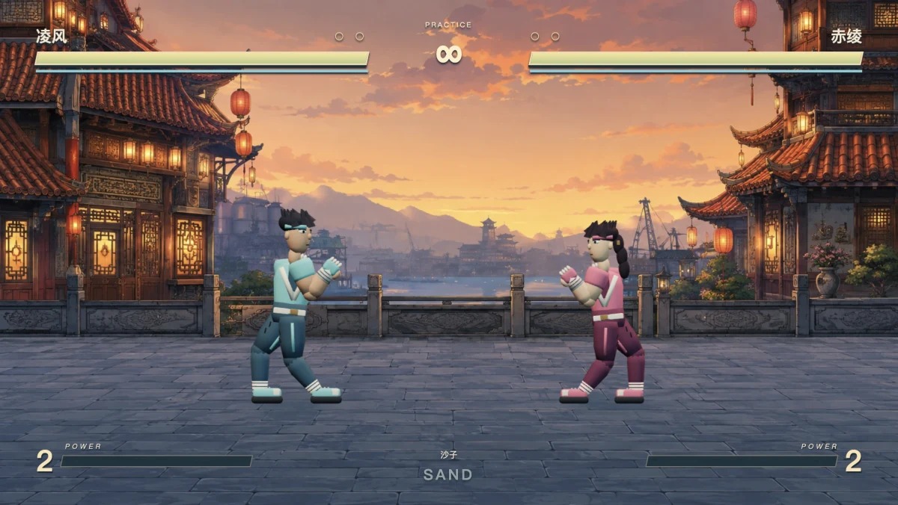
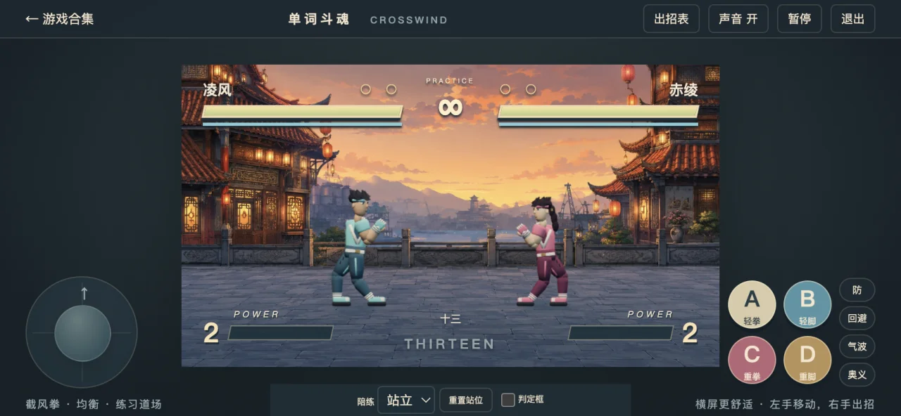
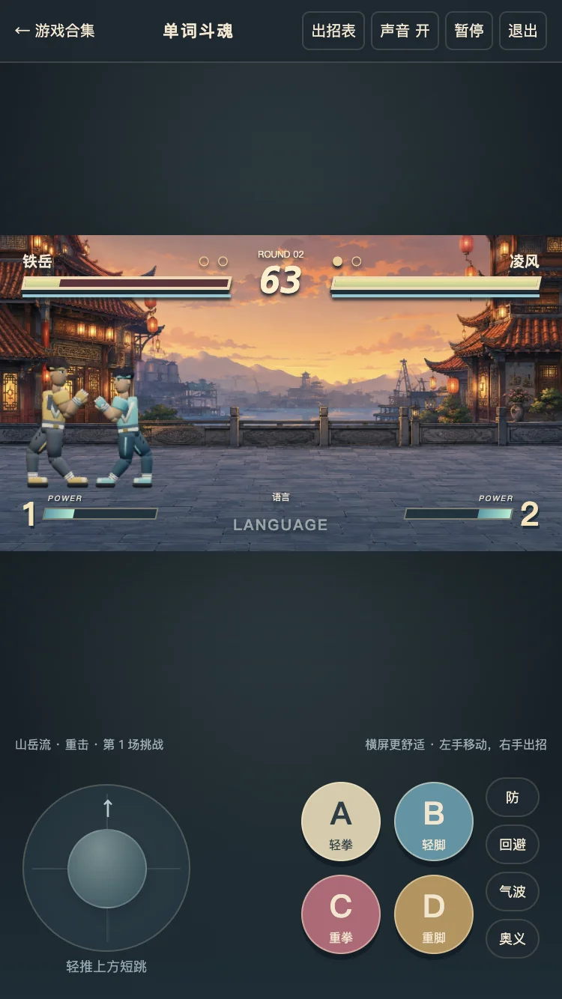

# 截风擂台 · 本轮验收记录

日期：2026-09-05。实现版本：`20260905-crosswind`。

## 检查方式

在 Intel Mac 的 Codex 内置 Browser 中运行正式游戏页面。没有启动无头 Chrome、独立 Playwright 浏览器或模拟器。手机尺寸与触摸通过浏览器设备模拟验证，**不是实体手机 GPU 性能测量**；手柄映射实现了，但本轮没有实体手柄测试。

浏览器夹具只通过页面按钮、键盘与 PointerEvent 输入，读取只读诊断；没有修改正式游戏的角色位置、血量或 AI 状态。60 秒交战使用诊断驱动的键盘试打程序，不等同于人类玩家的趣味性评价。

## 结果

| 项目 | 结果 |
| --- | --- |
| 纯战斗与动画规则 | `node --test tests/fury-combat.test.mjs`，37 / 37 通过 |
| 桌面最终输入回归 | 17 / 17 通过；1152 × 672 的嵌入式正式页面 |
| 手机横屏最终输入回归 | 19 / 19 通过；844 × 342，增加双指移动出招、触摸取消释放 |
| 手机竖屏最终输入回归 | 19 / 19 通过；375 × 619，包含双指、取消释放和双人独立键位 |
| 小屏正式页面 | 375 × 667、844 × 390、667 × 375；无横向或纵向页面溢出 |
| 模型与渲染 | 三个 GLB 成功加载；两人实机约 16,320 三角形、89 次 draw call、DPR 上限 1.5 |
| 60 秒交战 | 玩家 34 次命中、AI 10 次命中、观察到 11 种动作；没有超过 100 ms 的帧 |
| 十分钟加速规则试打 | 固定种子、36,000 次逻辑步；位置 / 姿势有限，投射物等集合有界 |
| 暂停 / 出招表 / 返回选人 | RAF 停止，活动音源 0，音乐定时器停止，AudioContext suspended |
| 最终桌面浏览器日志 | 无 error / warn |

最终桌面回归（1,164 个采样）的帧间隔中位数 16.6 ms，P95 18.4 ms；每帧 JS / 提交工作中位数 1.1 ms，P95 1.4 ms。60 秒试打中位数 16.7 ms、P95 18.3 ms，每帧工作中位数 1.1 ms、P95 1.4 ms。后者是主线程工作耗时，**不是 GPU 全链路渲染时间**，也不能据此承诺所有设备恒定 60 FPS。

## 验收覆盖

- 起手 / 有效 / 收招、单招单次接触、打空不可取消、命中确认三连、伤害与拼词推进。
- 高低段防御、劈挂破蹲防、抓投 / 拆投、回避可被投、起身投免、反向站位。
- 双方向 236 指令、过期输入不会误触必杀、能量门槛、防御取消、投射物命中和相消。
- 小跳与大跳轨迹不同，空中技落地清除，落地换边，双方同时命中可相杀。
- 短暂角色命中停顿不冻结世界计时；没有持续屏幕震动或动态摄像机缩放。
- 双人左右方向互不串控，2P 必杀不会作用于 1P，退出双人后停止音频与动画循环。
- 三局两胜终结、练习恢复体力、角色差异、姿势插值不出现 NaN、IK 上臂 / 大腿长度保持。

## 这轮检查中发现并修正的问题

1. 部分 loft 网格绕序反向：修正面法线，重新导出全部 GLB。
2. 手脚目标超出可达距离导致关节断开：限制目标距离，按三维两段 IK 重新求肘膝，并补足关节搭接。
3. 劈挂命中盒过高，打不到蹲防：同时调整有效区域和手部关键姿势，新增规则断言。
4. 一帧内完成方向加按键时丢失方向：攻击按下时锁存方向；短跳也单独记录快速松开。
5. 站防陪练向后漂移：防守状态不再通过后退方向伪装。
6. 手机横屏按键覆盖场地：摇杆、攻击区各自保留侧边空间，战场固定比例且不改碰撞距离。
7. 测试夹具在模型准备前开始：等待 GLB 就绪再启动正式页面；失败明确报出，不跳过检查。

## 实机图

下面均来自正式页面截图，不是 Blender 预渲染图或生成的宣传图。合集封面仅做裁切、缩放与 WebP 编码。

## 剩余边界

本轮建立了可继续打磨的连续关节模型与明确战斗规则；它仍是三名原创角色、一个场景的版本，不宣称已达到 KOF ’97 的招式数量、逐帧手绘动画质量或商业游戏内容量。角色使用刚性关节而非蒙皮肌肉变形。后续细化应以实际玩家反馈、实体手机与手柄测试为依据，而非把自动化通过当成“已和经典一样好玩”。
