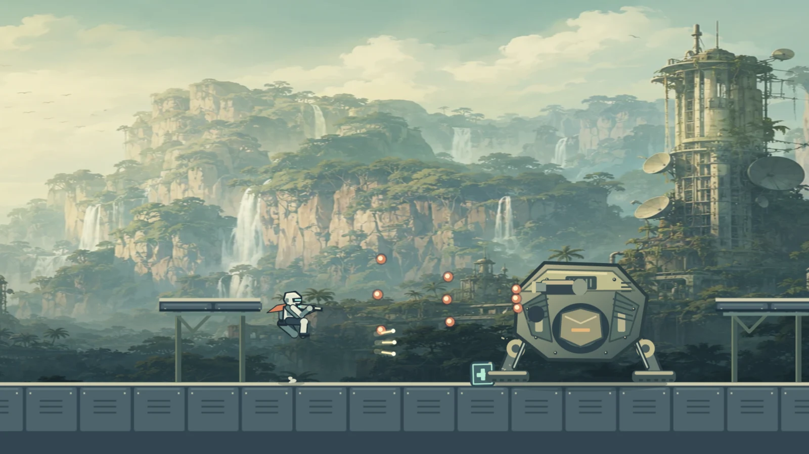
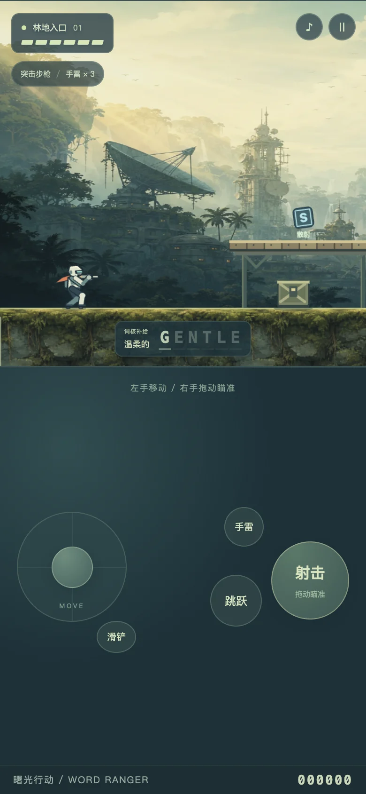
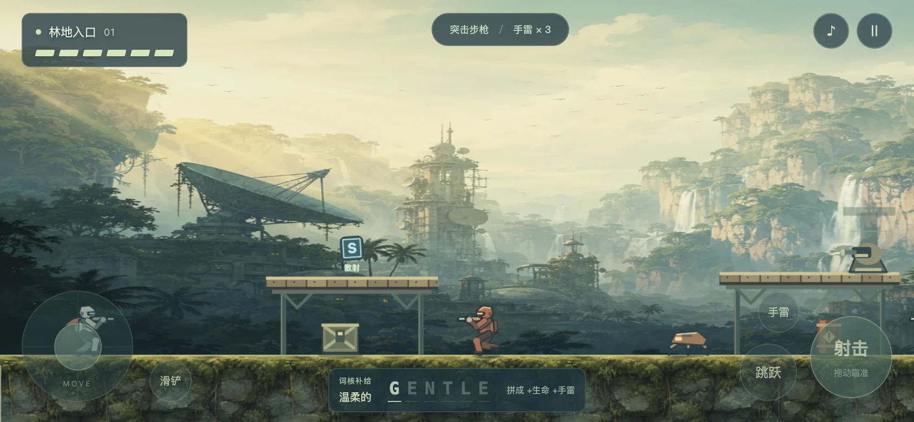

# 单词突击队 · 曙光行动：重制与验收

日期：2026-09-05。入口：`english-word-ranger/`。本轮只重建这一款，不能将结果外推到其他九款。

## 改动的目标与边界

旧版本同时存在命中停顿、受伤震动、多套素材及大体量单文件逻辑。单纯改变显示分辨率不能改善碰撞和操作。本轮重新实现物理、渲染、输入与音频，保留项目词库、游戏地址和合集入口。没有移植商业 ROM、角色、美术或音乐，也不声称已经达到魂斗罗或拳皇的完整内容质量。

| 体验问题 | 当前实现 | 检查方式 |
| --- | --- | --- |
| 操作与画面不连续 | 120 Hz 固定物理步进；渲染插值；按键在下一物理步响应；无全局命中停顿/震屏 | 首步移动、停止距离、反向时间、重放确定性测试；真实 RAF 回放 |
| 人物像移动贴纸 | 双腿关节与足底锚点；步态随移动距离；上下身分离；枪口、瞄准与子弹同一坐标来源 | 暂停单步观察；枪口锚点与移动平台插值测试 |
| 碰撞缺乏意义 | 实体箱体/地面阻挡；单向平台；连续线段弹道；蹲下改变受击框 | 薄墙穿透、掩体挡弹、箱顶落地、同高度子弹对蹲站结果不同 |
| 跳跃只有一种感觉 | 轻按短跳、长按高跳；95 ms 离地宽限、130 ms 落地缓冲；空中可调方向 | 短跳/高跳高度、宽限与缓冲测试 |
| 全部敌人一个解法 | 三连发步兵、冲锋机械兽、锁定炮台、无人机、正面盾兵；手雷/油桶连锁；三种武器 | 盾牌正反面与恢复期、爆炸连锁；标准生命值路线通关 |
| 随机模板缺乏地形题目 | 林地掩体教学 → 沟壑/平台 → 中段三路线 → 补给点 → 重装守卫 | 曙光、悬桥、逆流分别通关；升降/水平移动平台检测 |
| 首领只是大血条 | 可拆炮口；扇形、震波、迫击三种预警攻击；恢复期核心开放；分段锁血防一轮跳过 | 三种攻击与弱点窗口测试；持续射击不能锁死护盾计时 |
| 单词打断战斗 | 沿路收集正确字母；透明词条和短暂近身回显；完成词提供生命/手雷 | 字母不落坑、不永远追在身后；脱离视野后可回收 |
| 手机移动误射 | 左摇杆移动/蹲下；右射击键按住拖动独立瞄准；独立跳跃、手雷、滑铲 | 正式页面双触点、取消触点、重复触点、释放单手检查 |
| 暂停仍占用资源 | 暂停/失焦/菜单停止 RAF；停止并断开音源，停音乐调度器，挂起 AudioContext | 正式页面暂停时间不前进，音源 0，音乐计时器 false |

连续远征可以一直进入下一轮，但内容库是三条人工编排路线循环，并非无限种全新地形。后续应通过试玩扩展真正有效的战斗组合，不能以无限计分冒充无限内容。

## 可复现检查

在仓库根目录执行：

```sh
node --test english-word-ranger/tests/engine.test.mjs
node english-word-ranger/tests/playthrough.mjs 0 1 2 3 6 9
RANGER_TEST_WIDTH=540 node english-word-ranger/tests/playthrough.mjs
python3 -m http.server 4173 --bind 127.0.0.1
```

然后在内置 Browser 打开 `/english-word-ranger/tests/ui.html` 和 `/english-word-ranger/tests/playback.html`。回放页面可半速、暂停、单步，`?stop=23` 在第 23 秒自动暂停。测试页面与正式游戏共用引擎、绘制器和声音，不加载替代的简化场景。

- 引擎行为测试：19/19，通过。
- 正常输入通关：960 世界宽度下第 0/1/2/3/6/9 行动；540 世界宽度下第 0/1/2 行动全部通过，原始输出见 [playthrough-results.txt](playthrough-results.txt)。
- UI 输入/生命周期：15 项检查通过。它们对正式页面派发 DOM 键盘/指针事件，不修改玩家位置、生命、敌人、时钟或结果。
- 通关 pilot 只能返回常规操作输入，但能读取场景状态，因此通关时间不能用作普通玩家的平均游戏时长。自动通过证明可达性和回归稳定性，不证明好玩。
- 响应式视觉检查：390×844 竖屏、844×390 横屏、320×568 小屏；均无横向滚动。320×568 菜单可纵向滚动，开始按钮在首屏可达。
- 桌面实时回放记录与截图见本目录。性能数字只代表当前 macOS 内置 Browser，不是低端手机保证；JS 工作时长不等于系统总 CPU/GPU 使用率。

这一轮实际修复的验收问题包括：字母无法追上跑动玩家、离屏字母反复停止回收、移动平台的上一帧位置被误修改、首领护盾计时被连续命中重置、手机首领尚未入镜就开战，以及暂停音频节点延迟释放。

## 实战截图

截图由正常游戏或正常输入回放产生，不是概念宣传图。







生成素材的来源、模式和完整提示词见 [ART-PROVENANCE.md](ART-PROVENANCE.md)。背景/岩层使用 imagegen；角色、机械敌人、弹道、平台和界面由实际游戏绘制器绘制。
