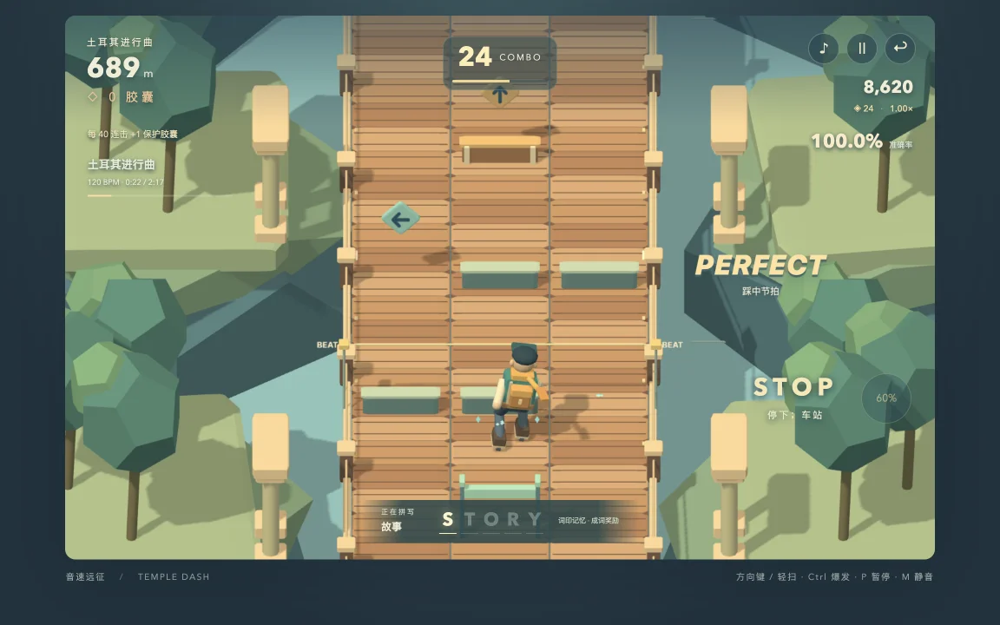
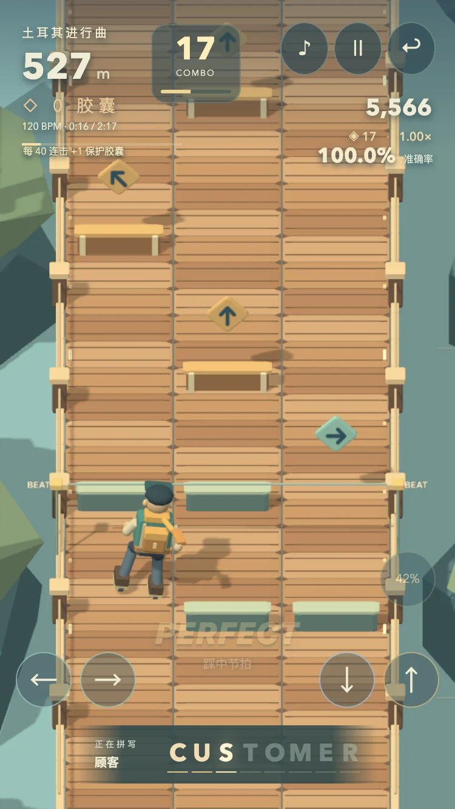

# 本轮验收记录

日期：2026-09-05。环境：当前 Mac 的 Codex 内置 Browser。移动端结果来自设备尺寸和触屏事件模拟，**不是实体 iPhone / Android 性能测量**。没有启动 Chrome、无头浏览器或额外浏览器进程。

## 自动断言

`node --test tests/temple-wind.test.mjs tests/temple-rhythm.test.mjs`：27 项。

- 自由跑酷：216 组普通输入长跑，覆盖 12 个种子 × 6 个速度 × 3 个难度；累计模拟 34,560 秒、973,440 米、三种环境，无碰撞。跳滑时机来自普通输入策略，不改生命、位置或无敌状态。
- 节奏模式：三首曲目 × 三档难度完整播放，判定头点全部对应源谱起拍，所有输入可正常通过。曲目分别含 101/128/161、93/127/153、46/61/82 个操作点。
- 单独覆盖错误方向、过早/过晚、漏掉组合键、长按提前松开、暂停重握、校准倍速单位、40 连击胶囊、准确率保真与爆发不变速。
- 每个 3D 障碍的八个顶点在远处、近处、经过角色时都保持相同速度和尺寸；正交解析投影与真实 Three.js 相机矩阵一致。
- 判定轨、箭头中心、长条尾端的坐标一致；快速连跳不会把角色高度重置到地面。

## 真实网页与输入

| 检查 | 结果 |
|---|---|
| 自由模式正式页面 | 30/30：键盘、滑动提前响应、取消手势、空中下滑、暂停、重试、音频状态、连续重启资源边界、手机尺寸 |
| 节奏模式生命周期 | 8/8：暂停停帧/停音、切速同步、快速暂停继续、静音清空音源、静音时计时、重新开声不重头播放、菜单空闲、结束成绩 |
| 145 BPM 困难整曲，1× | 82 Perfect，0 Miss；67.88 秒含预备/收尾，完整循环一次；2 次手动爆发 |
| 最终高倍速回归，145 BPM × 1.5 | 实际 217.5 BPM，45.24 秒跑完整曲与预备/收尾；82 Perfect、0 Miss、2 次爆发、无浏览器错误 |
| 120 BPM 标准，触屏按钮 55 秒 | 51 Perfect，0 Miss，最高 51 连击，包含双指组合、长按及一次爆发 |
| 320×568 竖屏菜单 | 无横向溢出，开始按钮 bottom 541 px，小于视口 568 px；其余说明可正常滚动 |
| 375×667 竖屏菜单 | 无横向溢出，开始按钮 bottom 541 px；游戏画布按视口铺满 |
| 844×390 横屏菜单 | 修正新增选曲后的高度，开始按钮 bottom 323 px；表单框 y=16..374 px，内部可滚动 |

测试输入器只读取下一拍的只读诊断并发送 DOM KeyboardEvent / PointerEvent，不写时钟、谱面、角色位置、生命或分数。自动演奏证明可判定、可重复，不等同于人类玩家对趣味性和难度的认可。

## 性能与资源

- 145 BPM 1× 整曲：帧间隔中位数约 16.7 ms，P95 约 18.5 ms；每帧 CPU 更新/提交工作的 P95 为 1.2–1.8 ms。音频时钟与模拟时间最大观测差约 29.7 ms，没有随曲目长度增加的累计漂移。
- 手机尺寸 375×667、设备 DPR 2、实际绘制 DPR 上限 1.5：画布 562×1000。55 秒触屏回归的 CPU 工作 P95 约 1.4–1.8 ms，帧间隔 P95 约 18.5 ms；最大时钟差约 29.3 ms。
- 最终 1.5× 整曲回归：帧间隔中位数 16.7 ms、P95 18.5 ms，CPU 工作 P95 1.5 ms、无丢弃追帧。最大钟差 44.5 谱面毫秒，除以 1.5 为 29.7 真实毫秒；暂停后音源 0、计时器关闭。这里的“手动爆发”指必须通过正常按钮事件触发，测试中由输入器点击，不是人工玩家成绩。
- 典型每帧 15–21 次绘制调用、8 份几何体，字符纹理按实际需要缓存并复用；反复重启没有持续增加几何体。
- 暂停/退出后：RAF 不运行，音频节点 0，调度计时器关闭，AudioContext suspended。离开页面进一步 dispose 材质、纹理、几何和 WebGL 渲染器。静音但继续游戏时保留音频时钟，没有声音节点和音乐调度计时器。
- 以上 CPU 工作时间不含独立的 GPU 时间测量；没有把它称为整机 CPU 百分比，也不能由桌面模拟保证所有低端手机表现。

## 实看后修正的缺陷

1. 发现悬空箭头与地面判定线视觉错位：统一到同一高度、同一前表面坐标，并增加数学验收。
2. 发现相机朝向文字与立体底板相交，导致箭头头部被切掉：节拍文字按注释层绘制，实物仍正常深度测试。
3. 手机新增曲目资料挡住观察区：信息集中到顶部；横屏新增表单超高：收紧布局并允许内部滚动。
4. 发现已弃用的 PCFSoftShadowMap 提示：使用当前版本 PCFShadowMap。

## 实际截图

以下来自当前运行网页，不是 ImageGen 概念图，也没有替换角色或拼合场景：

