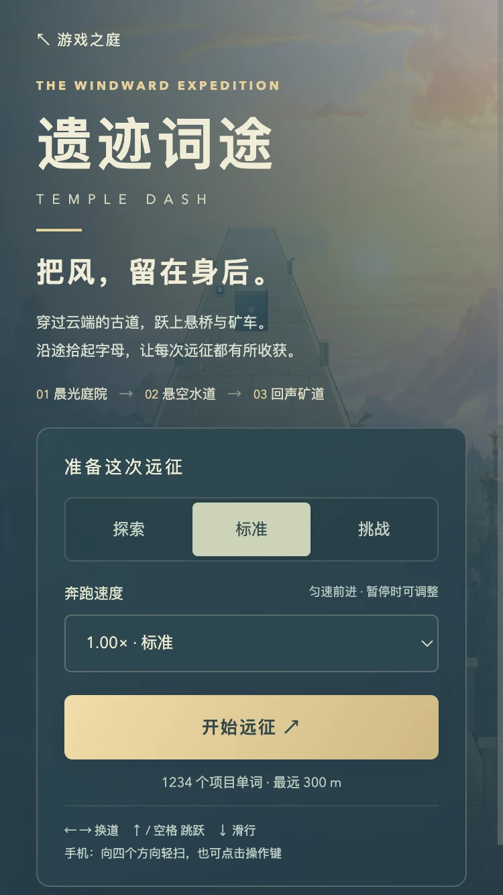
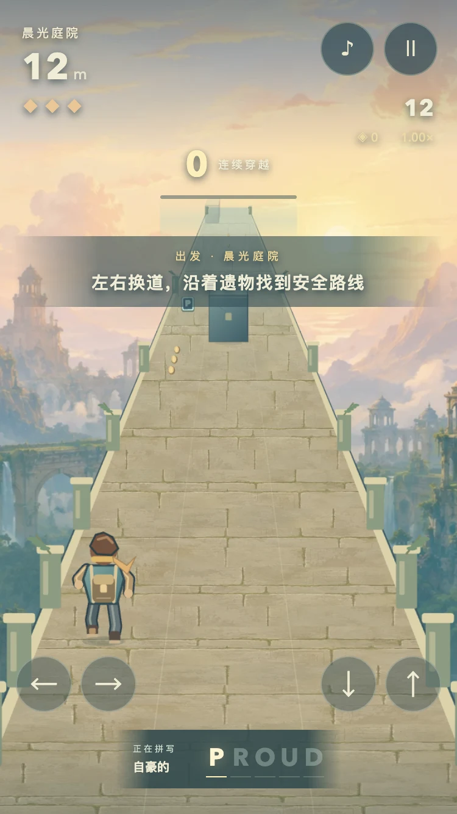
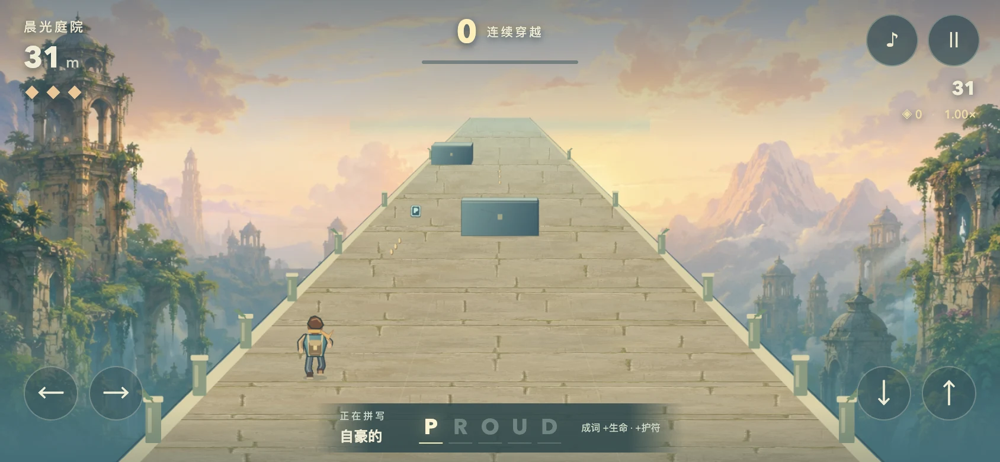
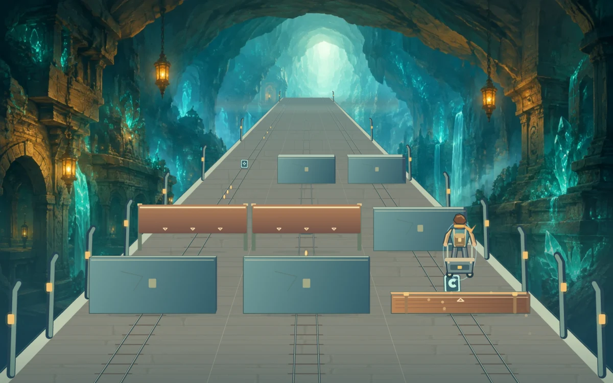

# 浏览器与视觉验收 · 2026-09-05

环境：macOS Codex 内置 Browser。未启动 Playwright/Chrome 无头进程。仅同时运行一个游戏回放；其他页面保持菜单/暂停。

## 正常输入实景回放

`/tests/temple-playback.html?stop=43`，seed 51，1.0× 标准难度。共用正式引擎、绘制器和音频。pilot 只输入换道、跳跃、滑行，不改生命、坐标、时钟、碰撞或无敌标志。

| 指标 | 观测 |
| --- | --- |
| 模拟时长 / 距离 | 43.01 秒 / 1,118.22 米 |
| 经过场景 | 晨光庭院 → 悬空水道 → 回声矿道 |
| 生命 / 损血次数 | 3 / 0 |
| 动作 | 换道 7、跳跃 6、滑行 3 |
| 成词 / 连续穿越 | 2 个 / 19 次 |
| 实际呈现帧数 | 2,577 |
| 帧间隔 P50 / P95 | 16.7 / 18.4 ms |
| JavaScript 每帧工作 P95 | 7.5 ms |
| 画布实际像素 | 1,798 × 1,123 |
| 停止后音频 | suspended、活动音源 0 |
| 本次最大活动对象 | 道路 7、奖励 28、粒子 36 |

这是当前机器上的一次测量。帧间隔包含浏览器调度；JS 时间不包含完整 GPU 合成成本。不能据此宣称任意手机都稳定 60 FPS，也不能把自动长跑当作人类对趣味性的认可。

## 正式页面输入与生命周期

`/tests/temple-ui.html`：22 项检查。包含首步换道、有限时间收束、重复键过滤、抬手前轻扫响应、滑动后不误跳、取消触点、实际起跳、空中下落接滑行、独立触屏键、暂停冻结/资源释放、暂停调速、失焦暂停、同种子重试、反复恢复、快速静音/开启、静音与暂停交错、返回菜单停止绘制。

测试对正式页面派发 DOM 键盘和 PointerEvent，不注入简化版控制器。触控逻辑检查不是触摸硬件延迟测量。实测由未静音状态运行，确认恢复后 AudioContext 为 running、调度器开启；暂停后音源与调度器为 0/false。

## 响应式检查

- 375×667：正式菜单与实战截图，开始按钮可见，字母、角色脚下与四个操作键分离。
- 320×568：页面无横向溢出，开始按钮范围 y=511.89–559.89，在首屏；菜单可纵向滚动看说明。
- 844×390：实战、暂停与恢复可用，无横向或纵向页面溢出；词条范围 x=266.63–577.37、y=340.5–382，完整在画面内。
- 390×844：逻辑视口/DOM 边界检查，无页面溢出。内置浏览器长屏截屏在 720 CSS px 后出现重复合成区域，因此没有把该异常截图拿来充当验收图片；采用 375×667、320×568 和横屏实图交叉检查。

## 检查中实际修复的问题

1. 路面绘制到屏幕下方之前被截断：扩大近端裁剪范围，直到覆盖完整视口。
2. 装饰柱悬在路面外：柱脚改为与边缘同一投影位置。
3. 道路随机源被拾取粒子消耗：地形与纯视觉随机源分离。
4. 换区域仍残留上一类模板：进入新环境重置模板袋和队列。
5. 高速反复暂停后音乐未真正恢复：音频上下文异步切换串行化，并加入快速静音和暂停交错回归。
6. 矿车轮距与轨道不一致、乘车时仍跑腿：轨距按实际车轮距离计算，乘车时关节姿势过渡至站稳握杆。
7. 装饰横梁干扰机关判断：移除跨越道路中央的装饰横线，仅保留边缘立柱和可交互机关。
8. 最远处物体在路面终点外出现：统一远裁剪，并加入前后端透明过渡。
9. 短竖屏操作键挡住脚部：竖屏落脚线略上移，仍由同一投影函数控制全部绘制。
10. 偶发浏览器停顿强行弹出暂停框：改为限制物理追赶步数；主动暂停、失焦与隐藏仍停止运行。

截图来自真实页面或原始 canvas 像素导出，只做 WebP 格式与尺寸压缩，没有 AI 修改实测画面。原始 PNG 暂存于本机测试临时目录，生成原画另行保留。
