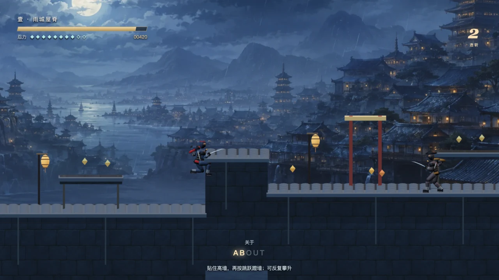
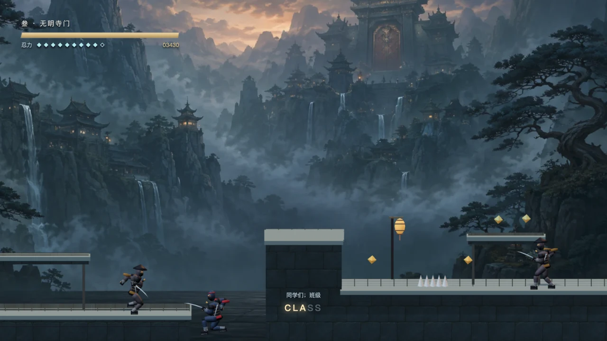

# 月影忍途 · MOONBLADE

[开始游戏](https://lgch3136.github.io/mini-games/english-moonblade/) · [素材 / imagegen 完整提示词](ART-PROMPTS.md) · [设计简表](DESIGN.md)

原创单人横版 2.5D 忍者动作闯关。参考经典忍者平台动作中的刀击、跳跃贴墙、蹬墙和消耗忍力的副武器；规则参考入口为 Nintendo 托管的 [Ninja Gaiden 原版说明书](https://www.nintendo.co.jp/clv/manuals/en/pdf/CLV-P-NACBE.pdf)。本作的输入窗口、物理参数、敌人、关卡、模型与音乐均为本项目重新设计，不是原 ROM 移植，也不声称复现原版帧数据或商业内容体量。



## 连续动作更新 · 20260906-silk

- 修复左右键重叠时停止、斩击中反向仍朝旧方向、同帧转身投掷向反方向发射。反向在首个逻辑帧生效；起跑 3 帧、松开 2 帧，轻刀不再反复拖慢跑速。
- 角色真实转体与分层动作过渡；下落时提前伸腿，落地接地与上半身收势独立。刀光从实际刀刃端点采样，只沿刀刃外缘留短拖尾。
- 月光勾边、暖灯光池和地面接触影；双向前视的平滑镜头，普通跳跃不缩放、不晃地面。
- 修复墙体、檐口、铺面共面造成的深度冲突；镜头不再把落地插值中的半空位置当作地面高度。
- 三个 Blender 模型均改为刚性骨骼合批：保留全部顶点、三角形和颜色，主角从 18 个部件绘制合成一次材质绘制，守卫和首领也分别合成一次。相同开场的绘制调用从 50 降至 15，像素比上限仍为 1.5，没有用降分辨率替代动作优化。
- 手机方向区支持按住滑动换向；多指、键盘别名、短按与取消事件独立处理。暂停/退出释放循环和音频，场景切换释放旧骨骼纹理。

## 这一版能玩什么

| 章节     | 主要变化                                                                             |
| -------- | ------------------------------------------------------------------------------------ |
| 雨城屋脊 | 跑跳、屋顶高低路、远程敌人、首次贴墙攀越                                             |
| 雾谷山道 | 连续蹬墙、高低分岔、浮台与峡谷路线                                                   |
| 无明寺门 | 机关与敌人组合；封闭场地内的两阶段首领：冲刺、低扫、跃击地波，预警后攻击，收招可反击 |

每章两个途中检查点，连同起点共三个重试点；生命耗尽可以无限重试。解锁章节保存在本地浏览器，途中检查点仅在本次游玩中保存。固定编排敌人不会因为镜头往回移动而原地复活。没有无限随机关卡、多角色装备树或数小时剧情：目前是三章完整流程的首个可玩版本。

沿途收集推进拼词，完成整词补充忍力。读取已有项目词库，可在出发页关闭，不设强制答题门。

## 操作

- A / D 或 ← / →：移动。
- 空格 / K / W：跳跃；轻点短跳，长按高跳。
- 空中靠墙减速下滑，再按跳跃蹬离墙面；转回墙面可继续攀升。
- J：刀击；按节奏连按三段，空中也能出刀。S / ↓ + J：下落斩。
- L / Shift：有短暂无敌时间的疾步，不能无限连续冲刺。
- I：消耗忍力投掷手里剑。
- P / Esc：暂停；顶部“出招”“退出”随时可用。
- 手机：建议横屏。左手移动/下方向，右手独立操作斩、跳、疾步与忍术；支持多指同时按住。

“宽容模式”增加体力与受击保护窗口，不会自动打怪或自动过关。

## 画面、动画与资源

- Three.js / WebGL 实际绘制 Blender 导出的忍者、守卫和首领，非平移角色截图。
- 连续关节姿态、步幅对应实际位移、空中收腿、贴墙、斩击与受伤动作；复用已有斗魂的 IK 求解。
- imagegen 原创雨城、雾谷寺院与石墙材质；瓦片、石墙、灯笼、检查点和尖刺使用实例化网格。
- Canvas2D 的刀光、飞镖、雨线、飞行敌人与粒子使用同一相机投影。角色、敌人、飞行物按固定逻辑帧之间插值。
- 正交镜头保持固定视野，不做周期性缩放；普通跳跃不拉动竖向镜头，攀升和地面高度变化才跟随。普通命中不震屏。
- 原创 138 BPM / 首领 150 BPM 的 32 小节合成配乐与动作音效，不使用原作音乐。
- 像素比上限 1.5，限制粒子、弹道和音频声部；暂停、切后台、出招表和退出都会停止帧循环及音频。离开页面释放 WebGL 与 AudioContext。



## 本轮验收 · 20260906-silk

本机 Intel i7-9750H，Codex 内置 Browser；手机仅为尺寸和触摸模拟，不是手机真机。

- Node：**90 / 90**，包括原有 66 项、新增的 21 项操作/镜头/地形/完整战斗路线检查，以及 3 项骨骼合批的逐顶点、颜色、资源独立性检查。
- 正式页面桌面操作 **22 / 22**，844 × 390 横屏触摸模拟 **26 / 26**。覆盖按键重叠、别名释放、同帧反向投掷、转体、双指、滑动换向、取消、暂停、退出与音频释放。
- 地形像素回归 **3 / 3**：连续四次原地跳跃，屋瓦/墙面区域采样 169 帧，最大平均像素差、变化像素比例及镜头高度变化均为 0。此结论只覆盖所采样的区域和条件，不是所有 GPU 上永不闪烁的保证。
- 24 秒连续往返、出刀、跳跃、空中反向回放通过；完整三章实战输入回放也通过。最后一轮各章 874 / 952 / 1424 个逻辑帧，剩余体力 12 / 11 / 6，首领被击败后才通过终点。使用宽容模式与读取诊断的测试控制器，不等于真人无辅助通关。
- 最后完整三章中，帧间隔中位数均为 **16.7 ms**，P95 为 **17.6 / 17.6 / 17.5 ms**；主线程更新与提交 P95 为 **3.0 / 3.3 / 3.1 ms**，各章未记录超过 100 ms 的帧。其余含诊断/像素读回及并行工作负载的测试阶段也出现过约 33 ms 的 P95 和单次长帧，未删除这些失败/波动记录。以上不能保证所有系统持续 60 fps，也不等于 GPU 耗时测量。
- 390 × 844 竖屏菜单与游戏未整页溢出；竖屏隐藏次要实时分数以免挤断忍力标签，闯关仍建议横屏。
- 自动试打曾在雨城高台后的坑中失败。Node 复现证实测试控制器把可直接下落的高台当作坑，额外起跳后越过了下方安全地面；修正测试路线及其浏览器缓存后重新通过。没有扩大碰撞平台、改生命或写入正式页面坐标来掩盖此失败。
- 完成及退出后 `raf=false / timer=false / voices=0 / audio=suspended`。测试没有启动无头 Chrome。

## 首版验收存档 · 20260906-moonblade

本机 Codex 内置 Browser；没有启动无头 Chrome。手机为尺寸及触摸模拟，**不是 Android / iOS 真机测试**。

- Node：新游戏 23 项测试通过；复用 IK 所在游戏的 43 项回归也通过，共 **66 / 66**。覆盖输入、跳跃缓冲、离地宽限、墙体、单向平台、连斩、弹道、受击、检查点、首领、三章路线及十分钟随机输入边界。
- 正式 UI 桌面回归：**12 / 12**；手机横屏：**14 / 14**，额外覆盖双指移动 + 刀击、pointercancel 释放。
- 1164 × 958 桌面、844 × 390 手机横屏、390 × 844 竖屏检查无整页溢出，开始、暂停和退出可用。
- 三章实际页面输入回放通过，包含正常敌人及完整首领。使用测试控制器发送键盘事件，读取诊断来选路；没有给正式页面写坐标、无敌状态或 Boss 血量。使用宽容模式，不等于人工无辅助通关。
- 最后完整输入回放：雨城 1261、雾谷 1034、寺门 2166 个逻辑帧；首领被击败后才允许最终过关，途中死亡 0 次，最终剩余 2 / 12 体力。
- 同轮各章滚动采样帧间隔中位数 16.7 ms，P95 为 18.0 / 17.8 / 17.9 ms，主线程更新与提交 P95 为 2.8 / 2.3 / 2.4 ms，未记录超过 100 ms 的帧。主线程时间不等于 GPU 总耗时，以上也不是所有硬件都能稳定 60 fps 的承诺。
- 完成/退出后诊断为 raf=false、timer=false、voices=0、音频 suspended。
- 实测修复：快速松开再按的蹬墙输入丢失；从空中经过检查点未保存；竖屏菜单拉伸模型；普通跳跃镜头上下摆动。原始失败没有计为通过，修复后重新跑完整流程。

自动通过只说明这些已列条件成立，不能证明趣味性达到商业经典。标准难度的真人体验、不同手机 GPU 的性能与长时间操作舒适度仍需玩家反馈。

## 复测与修改

仓库根目录：

```sh
python3 -m http.server 4173 --bind 127.0.0.1
node --test tests/moonblade.test.mjs tests/moon-flow.test.mjs tests/moon-rig.test.mjs tests/fury-combat.test.mjs
node tests/moon-traversal.mjs
```

浏览器打开 `tests/moon-browser.html`，可运行“全套回归”，或单独运行操作、地形闪动、24 秒连续动作、三章输入试打。测试结束按“停止并释放”；这会卸载游戏 iframe。测试控制器只在 tests 页面加载，正式游戏只提供只读 `moonDiagnostics()`。地形闪动测试读取少量 WebGL 像素，可能影响 GPU 时间，不应用那一轮统计代表正常性能。

`moon-traversal.mjs` 专门隔离地形可达性：会移除敌人并解锁测试终点，**不得把它当作正式战斗通关证据**。上方正式 UI 连续回放才包含实际战斗。

Blender 源码位于 `art/build_ninja.py`，可编辑场景为 `art/moonblade-cast.blend`。模型重新生成后需再检查动作连接和脚底接地。修改运行时代码不需要构建或安装 npm 依赖。
